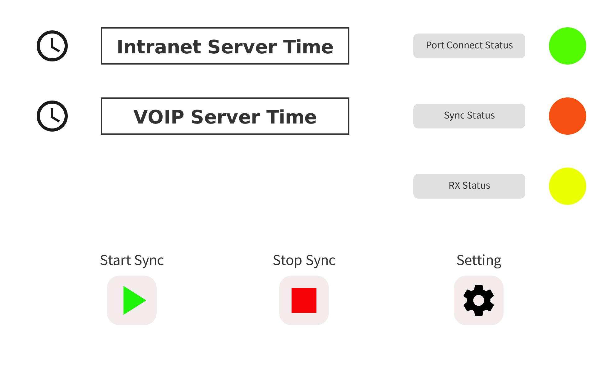
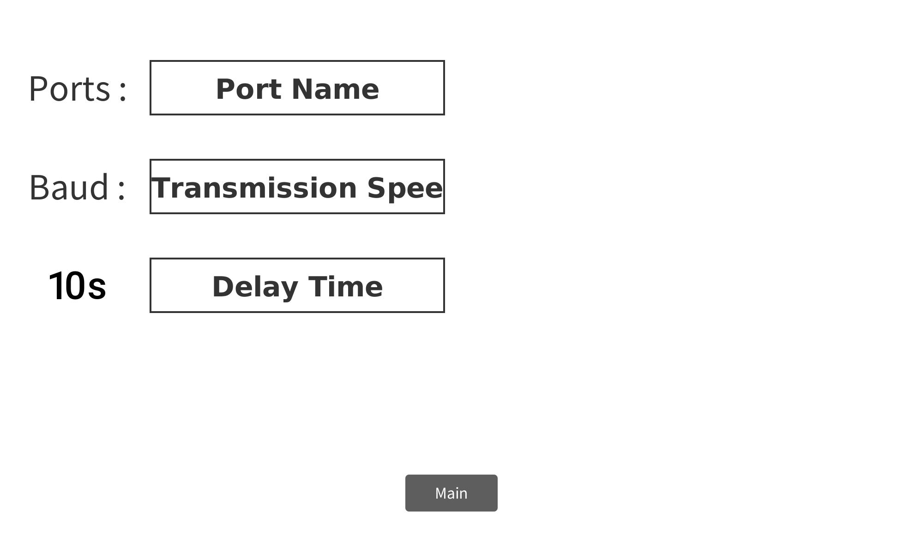

# Time_Sync_Program
Serial 통신을 이용한 시간 동기화 프로그램

# 깃허브 주소
https://github.com/sw0501/NTP

## 관련 사이트 주소
* https://egbox.tistory.com/39 (Win 10에서 VB 6.0 설치하는 법)
* http://whiteat.com/bSerialComCS/31641 (C# Windows Form에서 Serial 통신 데이터 받아오기)
* https://drbeeeye.tistory.com/82 (현재 PC의 시간을 실시간으로 받아오는 법)
* https://diy-dev-design.tistory.com/137 (설정을 저장하고 재실행 시 불러오는 법)
* https://m.blog.naver.com/PostView.naver?isHttpsRedirect=true&blogId=xyz37&logNo=50192959391 (C# 윈폼 화면 갱신하는 법)
* https://www.sysnet.pe.kr/2/0/11883 (C# 시스템 시간 변경하는 법)
* https://m.blog.naver.com/PostView.naver?isHttpsRedirect=true&blogId=jskimmail&logNo=220069215238 (C# 시스템 시간 변경하는 법 2)
* https://yaraba.tistory.com/1393 (C# 시스템 시간 변경하는 법 3 | 최신)
* https://m.blog.naver.com/PostView.naver?isHttpsRedirect=true&blogId=tjdah9921&logNo=221208499243 (C# exe 파일 빌드)
* https://nicebury.tistory.com/90 (C#으로 Serial Port에서 GPS 데이터 읽기)
* https://dklee.net/31 (C#으로 Serial Port에서 GPS 데이터 읽기 2)
* https://yaraba.tistory.com/1461 (가상 시리얼 포트 연결)
* https://www.intel.co.kr/content/www/kr/ko/support/articles/000017881/intel-nuc.html (Putty 시리얼 통신 입력 설정)

## 프로토타입
* https://so-bored.tistory.com/6 (UI 및 버그 수정 필요)

## 필요한 기능
- [X] GPS 수신값 중 시간 데이터 추출(날짜까지 제공하는 GPRMA에서 추출해야함)
- [X] 서버 PC의 시간 데이터 수신
- [X] 수신값이 들어왔는지 체크하는 기능
- [X] 포트/동기화/수신 상태 알람으로 표시
- [X] Serial 통신으로 데이터 값 읽기
- [X] 수신한 데이터를 Voip PC 시간으로 설정
- [X] 시간 동기화가 끊겼을 때 입력데이터가 없을 때 기존 PC의 클락펄스로 시계가 돌아가도록 설정
- [X] 최근에 동기화했던 서버시간 및 지연시간 저장 (영구)
- [ ] 시간 동기화의 지연시간을 고려하여 시간 조정
- [ ] RJ32 to USB 형식의 시리얼 통신시 포트 연결

## WFP 레이아웃

